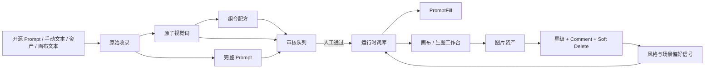

# FrameFlow 提示词系统迁入 Infinite Canvas 方案

> 目标项目：`basketikun/infinite-canvas` 本地个人分支  
> 来源项目：`ai-image-library-web`（FrameFlow）  
> 文档状态：实施基线  
> 核心原则：保留 Infinite Canvas 已有开源提示词库，将 FrameFlow 作为“我的仪表盘”迁入，不替换、不 iframe、不混用两套页面框架。

## 1. 迁移目标

把 Infinite Canvas 从“浏览和使用开源 Prompt”扩展为同时具备以下两种能力：

1. **开源词库**：继续聚合 GitHub 提示词来源，支持搜索、标签、详情、复制、加入资产和画布使用。
2. **我的仪表盘**：收录自己的原始 Prompt，拆成原子视觉词、组合配方和完整 Prompt，经过审核后发布到个人运行时词库，并通过 PromptFill 和画布消费。
3. **审美反馈闭环**：对图片进行 1–5 星、comment、soft delete 反馈，聚合成风格和场景偏好信号，为后续人工选择和自动任务提供依据。

本次迁移不增加定时自动出图。系统只管理提示词、收图、反馈和偏好信号；生成动作仍由用户在画布或生图工作台主动触发。

## 2. 当前基线

### 2.1 Infinite Canvas 已有能力

- `/prompts` 聚合多个远程提示词来源。
- IndexedDB 缓存远程 Prompt。
- 分类、标签、关键词过滤和无限滚动。
- Prompt 详情、参考图片、复制、加入资产。
- 自定义提示词来源及定时刷新。
- 画布内提示词选择器。
- React 19、Vite 7、React Router 7、Ant Design 6、Tailwind 4、Zustand、localforage。

### 2.2 FrameFlow 待迁能力

- 原始收录及来源证据。
- 原子视觉词、浏览分类和视觉职责。
- 原子词规范化去重与多来源合并。
- 组合配方及原子词引用关系。
- 完整 Prompt 独立存储。
- `pending / machine_passed / human_approved / needs_revision` 审核状态。
- 仅人工通过内容进入运行时词库。
- PromptFill 变量模板、自定义模板和即时编译。
- 图片星级、comment、soft delete 和偏好权重。

### 2.3 两边都尚未完整实现

- AI 自动拆解 Prompt。
- 根据评分自动重写 Prompt。
- 跨设备云同步或团队协作。
- 正式的 FrameFlow → Infinite Canvas 数据导入导出界面。

这些内容不作为“FrameFlow 等价迁移”的验收条件；导入导出会作为迁移所需的配套能力补充。

## 3. 目标信息架构

保留 `/prompts` 路由，在页面内部增加一级视图：

```text
提示词库 /prompts
├─ 开源词库
│  ├─ 来源分类
│  ├─ 标签与搜索
│  ├─ Prompt 详情
│  ├─ 复制
│  └─ 加入资产 / 插入画布
└─ 我的仪表盘
   ├─ 总览
   ├─ 原始收录
   ├─ 原子词
   ├─ 组合配方
   ├─ 完整 Prompt
   ├─ 审核队列
   ├─ 运行时词库
   ├─ PromptFill
   └─ 审美反馈
```

建议 URL 状态：

- `/prompts?view=public`：开源词库。
- `/prompts?view=mine`：我的仪表盘。
- 仪表盘内部子视图使用查询参数或页面内 Tabs，不首期扩张成大量路由。

保留现有顶部导航“提示词库”。切换至“我的仪表盘”后，顶部导航、Agent 面板和其他全局导航不得消失。

## 4. 核心工作流



首期最后一条 `偏好信号 → 运行时词库` 只做排序、筛选和推荐依据，不自动修改 Prompt 文本。

## 5. 领域模型

### 5.1 原始收录

```ts
type CaptureSourceType =
  | "manual"
  | "remote-prompt"
  | "asset"
  | "canvas-text-node"
  | "image-feedback"

type CaptureStatus = "pending" | "processed"

interface PromptCapture {
  id: string
  sourceText: string
  sourceType: CaptureSourceType
  sourceLabel?: string
  sourceRef?: {
    sourceId?: string
    promptId?: string
    assetId?: string
    canvasId?: string
    nodeId?: string
  }
  createdAt: string
  status: CaptureStatus
  derivedTermIds: string[]
  derivedRecipeIds: string[]
  derivedPromptIds: string[]
}
```

规则：原文是证据层，只能追加衍生关系，不能用摘要覆盖原始文本。

### 5.2 原子视觉词

```ts
type ReviewState =
  | "pending"
  | "machine_passed"
  | "human_approved"
  | "needs_revision"

interface VisualTerm {
  id: string
  label: string
  browseCategory: PromptBrowseCategory
  visualDuty: string
  sourceCaptureIds: string[]
  reviewState: ReviewState
  createdAt: string
  updatedAt: string
}
```

规则：

- `browseCategory` 回答“去哪里找”。
- `visualDuty` 回答“它真正改变画面的什么”。
- `label.trim().toLocaleLowerCase("zh-CN")` 相同的词不重复创建，而是补充来源。
- 首期不做自动同义词合并，只做规范化同名去重。

### 5.3 组合配方

```ts
interface PromptRecipe {
  id: string
  title: string
  termIds: string[]
  template?: string
  sourceCaptureIds: string[]
  reviewState: ReviewState
  createdAt: string
  updatedAt: string
}
```

规则：

- 至少引用两个有效原子词。
- 配方进入运行时前，自身和全部引用词都必须是 `human_approved`。
- `template` 可选；无模板时按原子词顺序拼接。

### 5.4 完整 Prompt

```ts
interface CompletePrompt {
  id: string
  title: string
  content: string
  sourceCaptureIds: string[]
  reviewState: ReviewState
  createdAt: string
  updatedAt: string
}
```

完整 Prompt 与原子词分开保存，禁止把整段 Prompt 伪装成一个原子词。

### 5.5 图片反馈

```ts
type Rating = 1 | 2 | 3 | 4 | 5

interface ImageFeedback {
  id: string
  assetId?: string
  canvasId?: string
  canvasNodeId?: string
  promptSnapshot?: string
  style?: string
  scene?: string
  rating?: Rating
  comment: string
  hidden: boolean
  createdAt: string
  updatedAt: string
}
```

反馈权重固定为：

| 操作 | 含义 | 权重 |
| --- | --- | ---: |
| 5 星 | 强化 | +3 |
| 4 星 | 继续变体 | +2 |
| 3 星 | 中性观察 | 0 |
| 2 星 | 降权 | -1 |
| 1 星 | 强降权 | -2 |
| soft delete | 强负反馈 | -4 |

soft delete 不物理删除图片，图片进入“已隐藏”视图，可恢复，并保留负反馈证据。

## 6. 深模块设计

将领域规则集中在一个深模块中。页面、画布和资产页只调用其接口，不自行复制审核、去重、权重和编译逻辑。

```text
web/src/lib/prompt-knowledge-base/
├─ domain.ts
├─ compiler.ts
├─ selectors.ts
├─ import-export.ts
└─ index.ts

web/src/stores/
├─ use-prompt-knowledge-base-store.ts
└─ use-image-feedback-store.ts
```

建议外部接口：

```ts
interface PromptKnowledgeBaseModule {
  capture(input: NewCapture): PromptCapture
  addCandidate(input: TermCandidate | RecipeCandidate | PromptCandidate): void
  review(input: ReviewCommand): void
  compileRuntime(): RuntimePromptLibrary
  queryRuntime(query: RuntimeQuery): RuntimeSearchResult
  exportSnapshot(): PromptKnowledgeBaseSnapshot
  importSnapshot(snapshot: unknown): ImportReport
}
```

接口约束：

- 调用方不直接维护 `derived*Ids`。
- 调用方不自行判断条目能否进入运行时。
- 导入时的 ID 重映射、重复词归一化和冲突报告全部封装在模块实现中。
- 时间和 ID 生成作为内部 seam，可在测试中替换；不暴露给普通页面调用方。
- 模块方法返回结果或报告，UI toast、Modal 等副作用留在页面层。

## 7. 目录落位

```text
web/src/pages/prompts/
├─ index.tsx                         # 一级视图容器
├─ public-library.tsx                # 现有开源词库迁入
├─ components/
│  └─ prompt-detail-dialog.tsx
└─ dashboard/
   ├─ index.tsx                      # 我的仪表盘
   ├─ overview.tsx
   ├─ captures.tsx
   ├─ terms.tsx
   ├─ recipes.tsx
   ├─ complete-prompts.tsx
   ├─ review-queue.tsx
   ├─ runtime-library.tsx
   ├─ prompt-fill.tsx
   └─ feedback.tsx

web/src/lib/prompt-knowledge-base/
web/src/stores/use-prompt-knowledge-base-store.ts
web/src/stores/use-image-feedback-store.ts
```

避免新增只转发 props 的浅模块。只有当仪表盘文件明显过大时才按上述子视图拆分。

## 8. 存储方案

### 8.1 Infinite Canvas 目标存储

业务列表遵循项目现有规范，统一使用 localforage / IndexedDB：

```text
database: infinite-canvas
store: prompt_knowledge_base
keys:
  prompt-knowledge-base:v1
  prompt-fill-templates:v1
  image-feedback:v1
```

不使用 `localStorage` 保存词库、反馈列表或大 JSON。Zustand store 负责响应式状态，localforage adapter 负责持久化。

### 8.2 真相数据与派生数据

- 真相数据：原始收录、候选条目、审核记录、图片反馈。
- 派生数据：运行时词库、偏好分数、统计卡片、搜索索引。
- 派生数据可以重建，不作为唯一数据源。

### 8.3 版本

导出快照必须包含：

```ts
interface PromptKnowledgeBaseSnapshot {
  schemaVersion: 1
  exportedAt: string
  knowledgeBase: PromptKnowledgeBase
  promptFillTemplates: PromptTemplate[]
  imageFeedback: ImageFeedback[]
}
```

本项目尚未上线，首期只支持 `schemaVersion: 1`，不为不存在的旧版本增加复杂兼容分支。

## 9. FrameFlow 数据迁移

由于 `localStorage` 按域名和端口隔离，`3001` 的 FrameFlow 数据不能被 `3002` 的 Infinite Canvas 直接读取。采用显式 JSON 导出导入：

### 9.1 FrameFlow 导出

增加一次性“导出迁移包”动作，读取：

- `frameflow.prompt-knowledge-base.v1`
- `frameflow.prompt-fill.custom-templates.v1`
- 图片反馈存储键

导出前做结构校验，不包含 API Key、Cookie、浏览记录或其他配置。

### 9.2 Infinite Canvas 导入

导入流程：

1. 校验 `schemaVersion` 和必要字段。
2. 原始收录完整保留。
3. 规范化原子词并合并重复来源。
4. 建立旧 ID → 新 ID 映射。
5. 重映射配方的 `termIds`。
6. 缺失引用或冲突条目进入 `pending`，不得直接批准。
7. 重复导入必须幂等，不制造重复记录。
8. 返回导入报告。

导入报告至少包含：新增、合并、跳过、冲突、失败数量和具体原因。

## 10. 页面与交互方案

### 10.1 开源词库

现有页面功能原样保留，只增加以下入口：

- Prompt 卡片：`收录到我的词库`。
- Prompt 详情：`收录原文`、`载入 PromptFill`。
- 保留原有 `复制` 和 `加入资产`，避免改变老用户路径。

`收录到我的词库` 创建 `remote-prompt` 类型原始收录，并保存来源 ID、Prompt ID 和 GitHub 地址。

### 10.2 我的仪表盘

总览卡片：

- 原始收录数。
- 原子词数。
- 待审核数。
- 运行时可用数。
- 已评价图片数。
- 正向 / 负向偏好信号数。

首期拆解方式为人工：

- 手动保存原文。
- 手动建立原子词并填写分类、视觉职责。
- 手动选择至少两个原子词组成配方。
- 手动保存完整 Prompt。

不放置虚假的“一键 AI 拆解”按钮。

### 10.3 审核队列

每个候选项展示：

- 类型、名称、来源。
- 当前状态。
- 机器校验、人工通过、需要返修。
- 依赖完整性提示。

机器校验与人工通过必须是两个真实状态，不能把机器结果显示为人工确认。

### 10.4 运行时词库

- 搜索原子词、配方、完整 Prompt。
- 查看来源和审核状态。
- 原子词可添加到 PromptFill 当前模板。
- 配方和完整 Prompt 可整体载入 PromptFill。
- 可复制或插入画布。

### 10.5 PromptFill

复用 PromptFill 规则，不直接搬迁 shadcn 页面：

- `{{subject}}`：普通变量。
- `{{subject: 默认内容}}`：带默认值变量。
- 同名变量多次出现只生成一个输入框。
- 未填写且无默认值时保留原始 `{{变量}}`，不静默删除意图。
- 模板即时编译预览。
- 内置模板 + 自定义模板。
- 自定义模板保存到 localforage。
- 操作：复制、保存为完整 Prompt、插入画布。

## 11. 画布和资产接入

### 11.1 画布提示词选择器

现有选择器新增两个视图：

- `开源词库`
- `我的运行时`

选择后写入当前回调，不改变画布已有节点协议。

### 11.2 从画布收录

文本节点或 Prompt 输入区域新增：

- `保存为原始收录`
- `保存为完整 Prompt`

必须记录 `canvasId` 和 `nodeId`，以便回溯来源。

### 11.3 图片反馈

在资产详情和图片节点详情中提供：

- 1–5 星。
- Comment。
- Soft delete / 恢复。
- 当前反馈含义提示。

反馈同时记录生成时的 Prompt 快照、风格和场景；否则后续无法解释偏好信号来自哪里。

## 12. 视觉与技术约束

- 使用 Infinite Canvas 现有 Ant Design 6、Tailwind 4 和主题 token。
- 使用 `AppProviders`、`useThemeStore` 和现有浅色 / 深色体系。
- 不迁移 FrameFlow 的侧栏、路由壳、shadcn 组件或 WebToMind 外观。
- 不使用 iframe 嵌入 FrameFlow。
- 页面文案使用中文。
- 新增按钮、Modal、列表遵守 Infinite Canvas 现有扁平、低视觉重量风格。
- 保留顶部导航和右侧 Agent 面板的一致行为。

## 13. 实施批次

### 批次 0：迁移基线

工作：

- 创建个人本地开发分支。
- 记录上游提交和当前版本。
- 确认 AGPL-3.0 使用方式。
- 保存当前 `/prompts`、画布选择器和资产页截图。

完成条件：源码基线、页面基线和许可证选择都有记录。

### 批次 1：领域深模块

工作：

- 迁移并调整 domain、compiler、selectors。
- 实现来源校验、去重、配方完整性、审核和运行时编译。
- 实现反馈权重和偏好聚合。

完成条件：全部领域规则可通过一个小接口验证，不依赖 React 或浏览器存储。

### 批次 2：本地持久化

工作：

- 建立 Zustand store。
- 使用 localforage 保存词库、模板和反馈。
- 实现 hydration、错误状态和持久化失败提示。

完成条件：刷新页面后数据仍存在；损坏数据不会导致页面崩溃。

### 批次 3：提示词中心分类

工作：

- 把现有 `/prompts` 内容整理为 `开源词库`。
- 新增 `我的仪表盘`。
- 增加 `收录到我的词库`。

完成条件：现有搜索、标签、复制、详情和加入资产行为没有回归。

### 批次 4：词库治理与 PromptFill

工作：

- 完成原始收录、原子词、配方、完整 Prompt、审核队列和运行时词库。
- 迁移 PromptFill 解析器、编译器、内置模板和自定义模板。

完成条件：能完成从原始收录到人工批准，再载入 PromptFill 的完整流程。

### 批次 5：画布与资产接入

工作：

- 画布选择器增加 `我的运行时`。
- 运行时 Prompt 插入画布。
- 画布文本保存为收录或完整 Prompt。

完成条件：Prompt 在词库、PromptFill、画布三处传递时内容不丢失。

### 批次 6：图片反馈闭环

工作：

- 资产和图片节点增加评分、comment、soft delete。
- 增加已隐藏视图和恢复。
- 聚合风格 / 场景偏好信号。

完成条件：反馈权重与列表可见状态符合固定映射，刷新后保持。

### 批次 7：迁移工具与浏览器验收

工作：

- FrameFlow 导出迁移包。
- Infinite Canvas 导入与报告。
- 跑完整浏览器工作流。
- 更新 CHANGELOG、pending-test 和 todo。

完成条件：现有 FrameFlow 数据可被迁入，且重复导入不产生重复数据。

## 14. 测试方案

### 14.1 领域测试

- 空原文不能收录。
- 原始文本原样保存。
- 原子词必须引用存在的原始收录。
- 同名原子词去重并补充来源。
- 配方至少有两个有效原子词。
- 完整 Prompt 不进入原子词列表。
- 机器校验不能进入运行时。
- 人工通过的词进入运行时。
- 配方引用未通过词时不能进入运行时。
- 返修条目不能进入运行时。
- 5/4/3/2/1 星与 soft delete 权重正确。
- 偏好信号按风格和场景正确累计。
- PromptFill 默认值、重复变量和未填写变量行为正确。

### 14.2 存储与迁移测试

- localforage 往返保存。
- 首次空库初始化。
- 损坏数据安全回退并报告。
- 导入 ID 重映射。
- 重复词合并来源。
- 配方引用重映射。
- 冲突条目回到待审核。
- 重复导入幂等。

### 14.3 浏览器验收流程

```text
打开开源词库
→ 收录一个公共 Prompt
→ 保留原文与来源
→ 建立两个原子词
→ 组成一个配方
→ 保存一个完整 Prompt
→ 机器校验
→ 确认尚未进入运行时
→ 人工通过
→ 在运行时搜索到结果
→ 载入 PromptFill
→ 修改变量并编译
→ 插入画布
→ 生成或关联一张图片
→ 打星、写 comment、soft delete
→ 查看偏好信号
→ 刷新页面确认数据仍存在
```

### 14.4 可访问性与响应式检查

- 所有 Tabs、按钮、评分控件可键盘操作。
- 审核状态不能只靠颜色表达。
- 星级按钮有明确可访问名称。
- 软删除有确认和恢复路径。
- 1280px、1440px、移动窄屏不横向截断核心操作。
- 浅色和深色主题文本、边框、选中态可辨识。

## 15. 验收清单

- [ ] `/prompts` 有“开源词库 / 我的仪表盘”两个稳定视图。
- [ ] 原有 1201 条提示词浏览能力没有回归。
- [ ] 公共 Prompt 可一键收录到个人词库并保留来源。
- [ ] 原始收录、原子词、配方、完整 Prompt 四层数据可用。
- [ ] 重复原子词会合并来源。
- [ ] 审核状态真实区分机器和人工。
- [ ] 未人工批准内容无法进入运行时。
- [ ] PromptFill 支持变量、默认值、重复变量和自定义模板。
- [ ] 个人运行时 Prompt 可插入画布。
- [ ] 图片支持星级、comment、soft delete 和恢复。
- [ ] 风格与场景偏好信号计算正确。
- [ ] 所有业务列表使用 localforage / IndexedDB。
- [ ] FrameFlow 导出、Infinite Canvas 导入及导入报告可用。
- [ ] 刷新浏览器后数据保持。
- [ ] 单元测试、类型检查、构建和浏览器主流程通过。
- [ ] CHANGELOG、pending-test、todo 和 AGPL 说明已更新。

## 16. 风险与处理

| 风险 | 处理方式 |
| --- | --- |
| 两套 UI 直接拼接导致风格割裂 | 只迁领域规则，UI 按 Infinite Canvas 重建 |
| `localStorage` 跨端口不可读 | 使用显式 JSON 导出导入 |
| 配方 ID 在合并后失效 | 导入时集中重映射并做引用校验 |
| 把机器判断冒充人工审核 | 状态分离，运行时只认 `human_approved` |
| 评分存在但无法追溯 Prompt | 保存图片生成时的 Prompt 快照及来源 ID |
| soft delete 变成物理删除 | 单独保存 `hidden`，提供已隐藏视图和恢复 |
| 反馈闭环被误解为自动学习 | 首期只提供可解释权重和排序，不自动改写文本 |
| 远程开源词库更新影响个人数据 | 远程缓存与个人词库使用独立 store |

回滚原则：每批次独立提交。若某批次验收失败，回滚该批次，不删除用户已有 IndexedDB 数据，不改动现有远程来源配置。

## 17. 许可证边界

Infinite Canvas 使用 AGPL-3.0：

- 本地个人使用和个人分支可以继续开发。
- 必须保留原作者、版权、许可证和来源说明。
- 如果向他人提供修改后的网络服务，需要按 AGPL-3.0 向对应用户提供完整源代码。
- 如果需要闭源商业使用，应先联系原作者取得商业授权。

本方案默认执行模式为：**个人本地 AGPL 分支，不直接推送上游仓库，不公开部署。**

## 18. 本期不做

- 定时自动生成图片。
- 自动 AI 拆词和自动审核。
- 自动根据评分改写 Prompt。
- Chrome 扩展。
- 账号、团队、权限和付费。
- WebDAV 或云同步。
- 替换现有生图 / 视频接口。
- 迁移 FrameFlow 的 shadcn 页面壳和 WebToMind 视觉。
- 未经确认推送 GitHub 或公开部署。

## 19. 最终交付物

1. 可运行的 Infinite Canvas 本地开发分支。
2. `/prompts` 中的“开源词库 / 我的仪表盘”。
3. 个人词库治理深模块及 localforage 持久化。
4. PromptFill 自定义模板模块。
5. 画布和资产接入。
6. 图片反馈及偏好信号。
7. FrameFlow 数据导出与 Infinite Canvas 导入。
8. 单元测试、浏览器验收记录和迁移报告。
9. CHANGELOG、pending-test、todo 与许可证说明。

## 20. 推荐执行顺序

先完成批次 0–4，交付“可用的个人提示词仪表盘”；通过中期验收后再完成批次 5–7，把画布、图片反馈和数据迁移接通。这样可以先验证核心领域模型，避免在数据结构未稳定前同时修改画布和资产系统。
